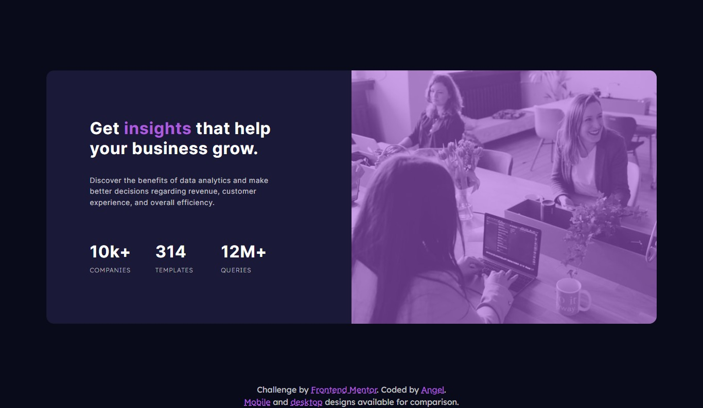
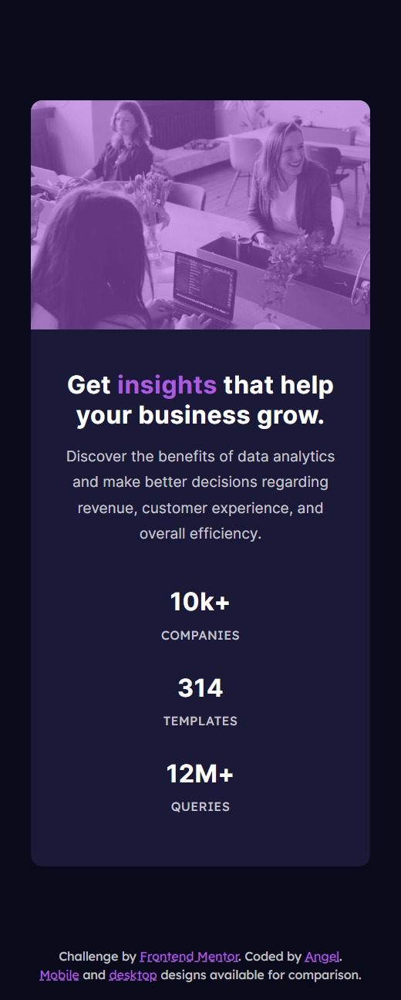

# Frontend Mentor - Stats preview card component solution

This is a solution to the [Stats preview card component challenge on Frontend Mentor](https://www.frontendmentor.io/challenges/stats-preview-card-component-8JqbgoU62). Frontend Mentor challenges help you improve your coding skills by building realistic projects. 

## Table of contents

- [Overview](#overview)
  - [The challenge](#the-challenge)
  - [Screenshot](#screenshot)
  - [Links](#links)
- [My process](#my-process)
  - [Built with](#built-with)
  - [What I learned](#what-i-learned)
  - [Continued development](#continued-development)
- [Author](#author)
- [Acknowledgments](#acknowledgments)

## Overview

### The challenge

Users should be able to:

- View the optimal layout depending on their device's screen size

### Screenshots

Desktop Site

Mobile Site

### Links

- [Solution URL](https://github.com/akcumeh/08-stats-preview-card-component)
- [Live Site URL](https://akcumeh.github.com/08-stats-preview-card-component)

## My process

### Built with

- Semantic HTML5 markup
- CSS custom properties
- [Bootstrap 5.1](https://getbootstrap.com/docs/5.1/getting-started/introduction/)

### What I learned

I had an issue with overlaying the image with color like in the designs. Fortunately I was shown a way to do it by a fellow Frontend Mentor user.

### Continued development

I find Bootstrap to be a very useful framework so I'm going to keep practicing more with it.
I'm also going to keep making websites that are as accessible as possible.

## Author

Thanks for reading this far! You can view and follow my profiles:

- GitHub - [@akcumeh](https://github.com/akcumeh)
- Frontend Mentor - [@akcumeh](https://www.frontendmentor.io/profile/akcumeh)
- Twitter - [@akcumeh](https://www.twitter.com/akcumeh)

## Acknowledgments

Many thanks to **Guillermo Mulvihill** ([@guilleoem](https://www.frontendmentor.io/profile/guilleoem)) who graciously reviewed my code and taught me how to overlay images with color!